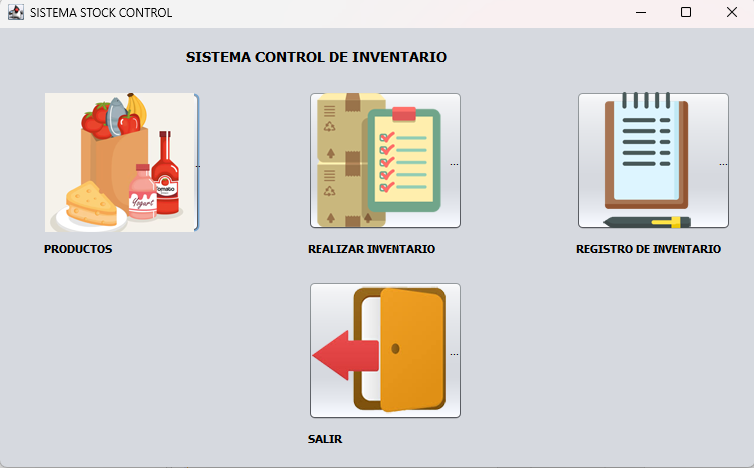
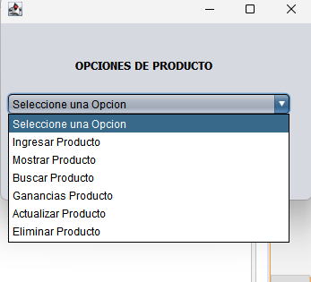
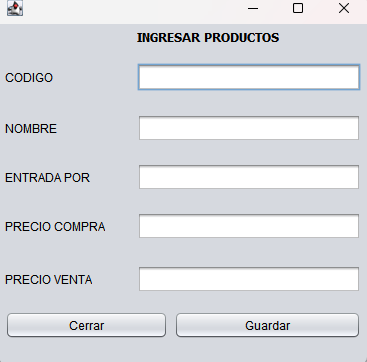
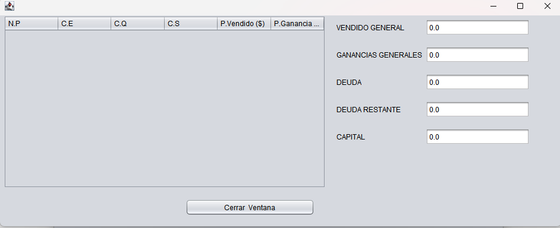
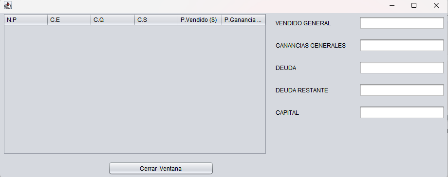
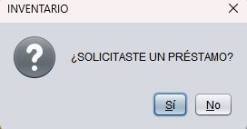

# 📦 StockControl - Sistema de Control de Inventario

[](https://www.java.com)
[](https://docs.oracle.com/javase/tutorial/uiswing/)
[](https://github.com/tuusuario/StockControl/releases)

## 📋 Descripción

**StockControl** es una aplicación de escritorio desarrollada en **Java Swing** para la gestión completa de inventarios en tiendas o pequeños negocios. Permite controlar productos, registrar ventas, calcular ganancias y administrar préstamos de forma sencilla e intuitiva.

---

## ✨ Características principales

- **Gestión de productos**: Ingresar, mostrar, buscar, actualizar y eliminar productos.
- **Control de inventario**: Realizar inventarios y llevar registro detallado.
- **Cálculo de ganancias**: Visualiza ventas totales y ganancias por producto.
- **Sistema de préstamos**: Administra préstamos con deuda y capital.
- **Interfaz amigable**: Diseño limpio y fácil de usar con menús claros.

---

## 🛠️ Tecnologías utilizadas

- **Lenguaje**: Java 17+
- **Interfaz gráfica**: Swing (javax.swing)
- **Entorno de desarrollo**: NetBeans / IntelliJ IDEA / Eclipse
- **Control de versiones**: Git y GitHub

---

## 🖼️ Capturas de pantalla

| Menú principal | Opciones de producto | Ingreso de productos |
|:--------------:|:--------------------:|:--------------------:|
|  |  |  |

| Lista de productos | Resumen de ventas | Gestión de préstamos |
|:------------------:|:-----------------:|:--------------------:|
|  |  |  |

---

## 🚀 Cómo probar el programa

### Opción 1: Descargar el ejecutable (recomendado)
[](https://github.com/camilo19p/StockControl/releases)

1. Ve a la sección **[Releases](https://github.com/camilo19p/StockControl/releases)**
2. Descarga el archivo `StockControl.jar`
3. Ejecuta con: `java -jar StockControl.jar`

### Opción 2: Ejecutar desde el código fuente
```bash
# Clonar el repositorio
git clone https://github.com/camilo19p/StockControl.git

# Entrar a la carpeta
cd StockControl

# Compilar
javac *.java

# Ejecutar
java Main
