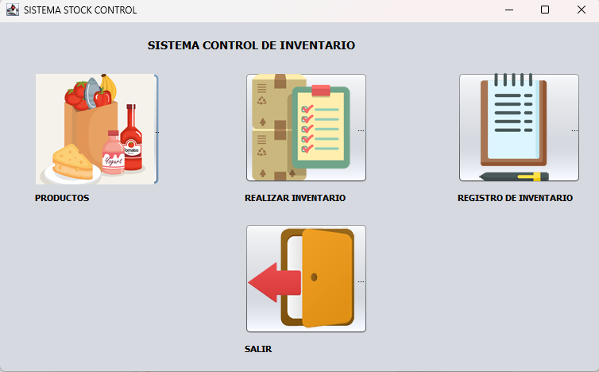
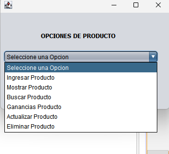
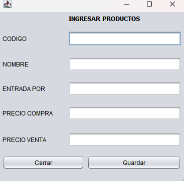
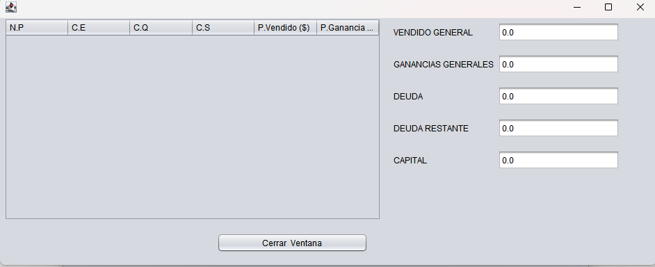
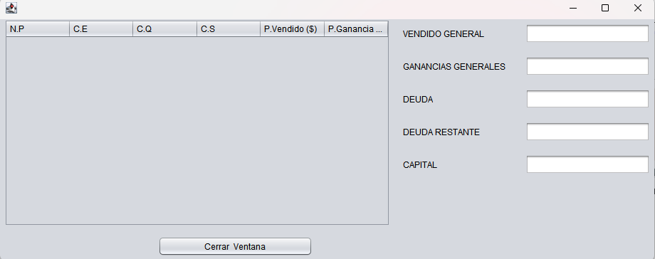
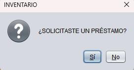

# 📦 StockControl - Sistema de Control de Inventario

[](https://www.java.com)
[](https://docs.oracle.com/javase/tutorial/uiswing/)
[](https://github.com/camilo19p/StockControl/releases)

## 📋 Descripción

**StockControl** es una aplicación de escritorio desarrollada en **Java Swing** diseñada para la gestión completa de inventarios en tiendas, pequeños negocios o almacenes. Permite controlar productos, registrar ventas, calcular ganancias y administrar préstamos de manera sencilla, intuitiva y eficiente.

**Proyecto desarrollado por:**
- Camilo Andrés Martínez Peña  
- Jader Luis Cardales Pinto  
- Kevin Alexander Vásquez García  
- Luis Ernesto Mercado Barrios  

---

## ✨ Características principales

- **Gestión de productos**: Ingresar, mostrar, buscar, actualizar y eliminar productos  
- **Control de inventario**: Realizar inventarios periódicos y mantener registro detallado de existencias  
- **Registro de ventas**: Registrar ventas y actualizar stock automáticamente  
- **Cálculo de ganancias**: Visualizar ventas totales, ganancias por producto y resúmenes financieros  
- **Sistema de préstamos**: Administrar préstamos con seguimiento de deuda, capital e intereses  
- **Interfaz gráfica amigable**: Diseño limpio con menús claros y navegación intuitiva  

---

## 🛠️ Tecnologías utilizadas

- **Lenguaje**: Java 17+  
- **Interfaz gráfica**: Swing (javax.swing)  
- **Persistencia**: Archivos (JSON, TXT o base de datos simple según implementación)  
- **Entorno de desarrollo recomendado**: NetBeans, IntelliJ IDEA o Eclipse  
- **Empaquetado**: JAR ejecutable  
- **Control de versiones**: Git y GitHub  

---

## 🖼️ Capturas de pantalla

| Menú principal          | Opciones de producto     | Ingreso de productos     |
|-------------------------|--------------------------|--------------------------|
|  |  |  |

| Lista de productos      | Resumen de ventas        | Gestión de préstamos     |
|-------------------------|--------------------------|--------------------------|
|  |  |  |

> **Nota**: Las imágenes se encuentran en la carpeta `/capturas` del repositorio.
---

## 🚀 Cómo probar el programa

### Opción 1: Descargar el ejecutable (recomendado para usuarios finales)

1. Ve a la sección **[Releases](https://github.com/camilo19p/StockControl/releases)**  
2. Descarga el archivo `StockControl.jar` (versión más reciente)  
3. Ejecuta el archivo con el comando:  
   ```bash
   java -jar StockControl.jar
→ Requiere tener Java 17 o superior instalado en tu computadora.
Opción 2: Ejecutar desde el código fuente
Bash# 1. Clonar el repositorio
git clone https://github.com/camilo19p/StockControl.git

# 2. Entrar a la carpeta del proyecto
cd StockControl

# 3. Abrir el proyecto en tu IDE preferido (NetBeans, IntelliJ IDEA o Eclipse)
#    - Importar el proyecto
#    - Compilar y ejecutar la clase principal (generalmente Main.java o similar)

📜 Licencia y Derechos de Autor
© 2023 Camilo Andrés Martínez Peña y colaboradores
Todos los derechos reservados.
Este software, su código fuente, ejecutables (.jar), documentación, capturas de pantalla y recursos asociados están protegidos por derechos de autor.
Está estrictamente prohibido (sin autorización escrita previa de los autores):

Copiar, reproducir, modificar, adaptar o crear obras derivadas
Distribuir, publicar, compartir o subir a otros repositorios/plataformas
Usar el programa (incluido el .jar) con fines comerciales, institucionales, educativos o cualquier otro
Eliminar o alterar esta nota de derechos de autor o los créditos de los desarrolladores

Cualquier uso no autorizado constituye una infracción a los derechos de autor y puede ser perseguido legalmente.
Si estás interesado en utilizar StockControl, obtener una licencia, colaborar o solicitar permiso, por favor contacta directamente a los autores.
Contacto: martinezcamilo25p@gmail.com
Sin una licencia explícita de código abierto, el uso, copia o distribución sin consentimiento expreso está prohibido.
